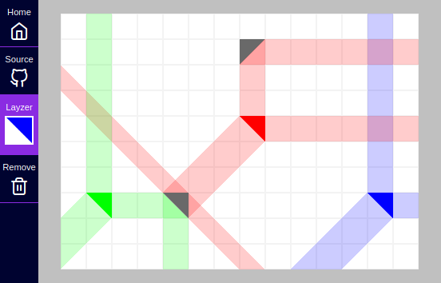

# lay-zers
## A laser playground for the imaginative
You get a canvas to plop down *layzers* and see how they interact with each other.

### But why?
Good question. The [playground](https://projects.sransara.com/lay-zers/) itself is very unrestrictive and sans objectives. *(1)* It's goal is to inspire you to imagine your own game out of *layzers*. Then when you are struck with an interesting game idea then this codebase should provide a working starting ground. If I say so myself, the [main codebase](https://github.com/sransara/lay-zers/blob/master/src/main.ts) is extendible but straight forward with just the right amount of abstractions. *(2)* The goal of the codebase is to provide the code blocks necessary for your **next ground breaking *layzer* game**. *(3)* If nothing else this should serve as a an interesting [Pixi.js](https://www.pixijs.com/) demo. My lessons learned retrospective writeup can be found at: http://sransara.com/notes/


### Live
https://projects.sransara.com/lay-zers/

### Screenshot



### Tech
Made with PixiJS & Typescript :heart:

### How to run locally
```
git clone https://github.com/sransara/lay-zers
cd lay-zers

# dev server
npm run start

# production server
npm run build && npm run serve
```

