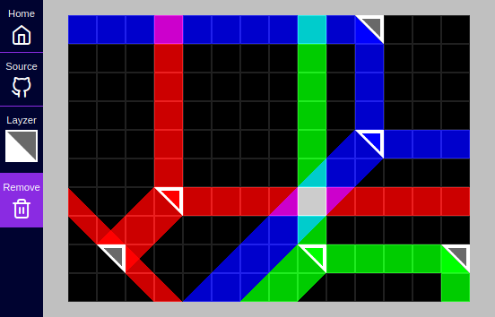

# lay-zers
## A laser playground for the imaginative
You get a canvas to plop down *layzers* and see how they interact with each other in an [additive color model](https://en.wikipedia.org/wiki/Additive_color) just like real lasers.

### But why?
Good question. The [playground](https://lab.sransara.com/lay-zers/) itself is very nonrestrictive and sans objectives. 
*(1)* It's goal is to **inspire you to imagine your own game** out of *layzers*. 
Once you are struck with an amazing game idea with layzers, then *(2)* this codebase should provide the code blocks necessary for **bringing life to your next hit game**.
The [main codebase](https://github.com/sransara/lay-zers/blob/master/src/main.ts) is extendible but straight forward with just the right amount of abstractions, if I say so myself. 
*(3)* If nothing else, this project should serve as a an interesting [Pixi.js](https://www.pixijs.com/) demo.

For me this was a stepping stone weekend project. 
Some lessons learned were noted [here](https://sransara.com/notes/2020/project-lay-zers-release-v0.0-retrospective/).

### Live
https://lab.sransara.com/lay-zers/

### Screenshot



### Tech stack
[Pixi.js](https://www.pixijs.com/) as the WebGL interface & [Typescript](https://www.typescriptlang.org/) 😎

### How to run locally
```
git clone https://github.com/sransara/lay-zers
cd lay-zers

# dev server
npm run start

# production server
npm run build && npm run serve
```

